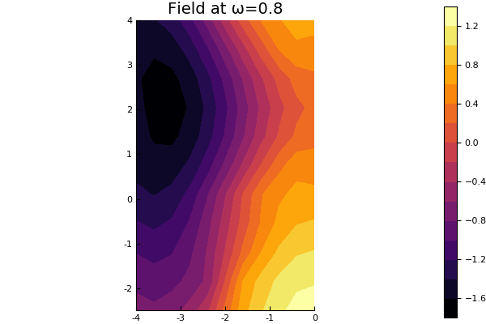
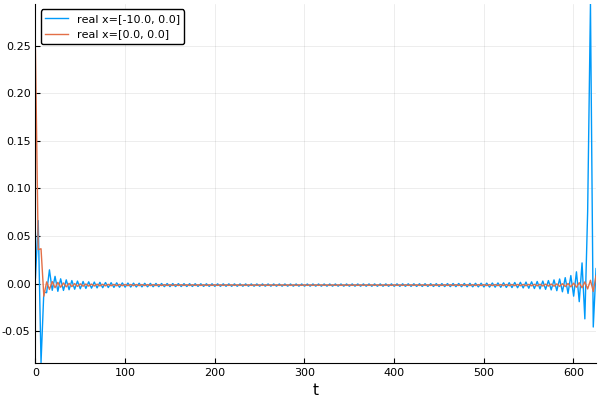
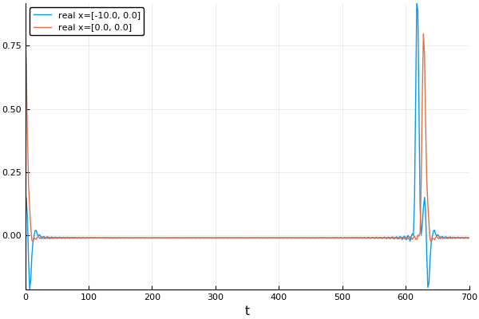

# MultipleScattering

<!-- [![][docs-stable-img]][docs-stable-url]  -->
[![][docs-dev-img]][docs-dev-url] [](doi-url) [![][travis-img]][travis-url] [![][codecov-img]][codecov-url] [![][coveralls-img]][coveralls-url]

*A Julia library for simulating, processing, and plotting multiple scattering of waves.*

The library uses the multipole method to solve the Helmholtz equation
(time-harmonic waves). The multipole method is particularly efficient at solving scattering problems for particles in an infinite domain. This library is configured to use T-matrices to represent scattering from particles with any shape and properties (currently implemented for acoustics). The package is setup to deal with different spatial dimensions and types of waves which satisfy Helmholtz equation's, e.g. acoustics, electromagnetism, elasticity. For details on some of the maths see [Martin (1995)](https://pdfs.semanticscholar.org/8bd3/38ec62affc5c89592a9d6d13f1ee6a7d7e53.pdf) and [Gower et al. (2017)](https://arxiv.org/abs/1712.05427).

<!-- If you are here to learn about
[Near Surface Backscattering](example/near_surface_backscattering), then [click here](example/near_surface_backscattering) to see an example. For details on the maths see [Gower et al. (2018)](https://arxiv.org/abs/1801.05490). To see how to take the [moments](example/moments) of the backscattering [click here](example/moments). -->

## Installation
This package is tested and works for Julia 0.6.
To get started, download and include the library
```julia
Pkg.clone("https://github.com/jondea/MultipleScattering.jl.git")
using MultipleScattering
```

## Documentation

- [**STABLE**][docs-stable-url] &mdash; **documentation of the most recently tagged version.**
- [**DEVEL**][docs-dev-url] &mdash; *documentation of the in-development version.*

## Simple example
### Run
Define the properties of your host medium, for example
```julia
host_medium = Acoustic(2; ρ=1.0, c=1.0) # 2D acoustic medium with density ρ = 1.0 and soundspeed c = 1.0
```
an acoustic medium in 2D with density 1 and wavespeed 1.

Next, define two dense, circular acoustic particles, the first centred at [-2,2] with radius 2 and the second at [-2,-2] with radius 0.5,
```julia
particle_medium =  Acoustic(2; ρ=10.0, c=2.0) # 2D acoustic particle with density ρ = 10.0 and soundspeed c = 2.0
p1 = Particle(particle_medium, Circle([-2.0,2.0], 2.0))
p2 = Particle(particle_medium, Circle([-2.0,-2.0], 0.5))
particles = [p1,p2]
```

Lastly we define the source, for example an incident plane wave () using a helper function.
```julia
source = plane_source(host_medium; direction = [1.0,0.0])
```

Once we have these three components, we can build our `FrequencySimulation` object
```julia
simulation = FrequencySimulation(host_medium, particles, source)
```

To get numerical results, we run our simulation for specific positions and angular frequencies,
```julia
x = [[-10.0,0.0], [0.0,0.0]]
max_ω = 1.0
ω = 0.01:0.01:max_ω
result = run(simulation, x, ω)
```

### Plot
The package also provides recipes to be used with the `Plots` package for
plotting simulations after they have been run.
In our above simulation we ran the simulation for 100 different wavenumbers, and
measured the response at the location (-10,0).
We can plot the time-harmonic response across these wavenumbers by typing:
```julia
using Plots
plot(result)
```


For a better overview you can plot the whole field in space for a specific angular frequency by typing:
```julia
ω = 0.8
plot(simulation,ω)
```


This measures the field at lots of points in the domain, so we can get an
understanding of what is happening for one particular angular frequency.

Note: most things in the package can be plotted by typing `plot(thing)` if you
need an insight into a specific part of your simulation.

To calculate an incident plane wave pulse in time use:
```julia
time_result = frequency_to_time(result)
plot(time_result)
```

Or for a Gaussian impulse in time:
```julia
t_vec = LinRange(0.,700.,400)
time_result = frequency_to_time(result; t_vec = t_vec, impulse = GaussianImpulse(max_ω))
plot(time_result)
```


## More examples
There are a lot of defaults implicit in this basic example.
Almost every part of the problem can be controlled, for example we can manually
construct the set of particles, define their positions, radii and give them
specific material properties. For all examples see [here](example/README.md).

## Acknowledgements and contributing
This library was restructured from one written by
[Artur L Gower](https://arturgower.github.io/) and
[Jonathan Deakin](http://jonathan.thedeakin.net).
Please contribute, if nothing else, criticism is welcome.
We are relatively new to Julia, and this is our first package, if anything is
untoward or even non-standard, please let us know.

[docs-dev-img]: https://img.shields.io/badge/docs-dev-blue.svg
[docs-dev-url]: https://jondea.github.io/MultipleScattering.jl/dev

[docs-stable-img]: https://img.shields.io/badge/docs-stable-blue.svg
[docs-stable-url]: https://jondea.github.io/MultipleScattering.jl/stable

[doi-img]: https://zenodo.org/badge/96763392.svg
[doi-url]: https://zenodo.org/badge/latestdoi/96763392

[travis-img]: https://travis-ci.org/jondea/MultipleScattering.jl.svg?branch=master
[travis-url]: https://travis-ci.org/jondea/MultipleScattering.jl

[codecov-img]: http://codecov.io/github/jondea/MultipleScattering.jl/coverage.svg?branch=master
[codecov-url]: http://codecov.io/github/jondea/MultipleScattering.jl?branch=master

[coveralls-img]: https://coveralls.io/repos/github/jondea/MultipleScattering.jl/badge.svg?branch=master
[coveralls-url]: https://coveralls.io/github/jondea/MultipleScattering.jl?branch=master

[issues-url]: https://github.com/jondea/MultipleScattering.jl/issues
