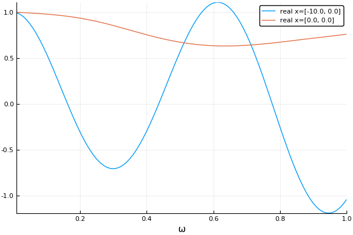
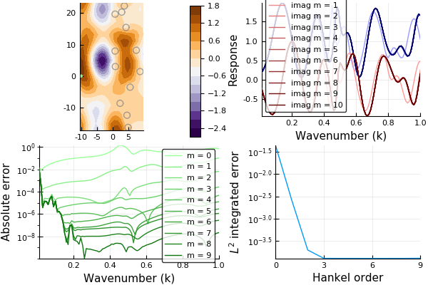
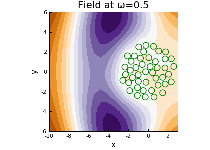
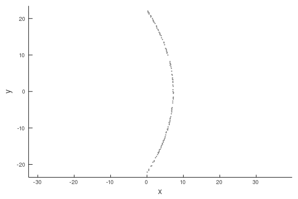

# MultipleScattering

<!-- [![][docs-stable-img]][docs-stable-url]  -->
[![][docs-dev-img]][docs-dev-url] [![][doi-img]][doi-url] [![CI][ci-img]][ci-url] [![][codecov-img]][codecov-url] [![][coveralls-img]][coveralls-url]

*A Julia library for simulating, processing, and plotting multiple scattering of waves.*

The library focuses on multipole methods (addition translation theorems) to solve the inhomogeneous Helmholtz equation
(time-harmonic waves). Multipole methods are particularly efficient at solving scattering from particles in an infinite domain. This library is configured to use T-matrices (also known as scattering matrices) to represent scattering from particles with any shape and properties (currently implemented for acoustics).

The package is setup to deal with different spatial dimensions and types of waves which satisfy Helmholtz equation's, e.g. acoustics, electromagnetism, elasticity. For details on some of the maths see [Martin (1995)](https://pdfs.semanticscholar.org/8bd3/38ec62affc5c89592a9d6d13f1ee6a7d7e53.pdf) and [Gower et al. (2017)](https://arxiv.org/abs/1712.05427).

<!-- If you are here to learn about
[Near Surface Backscattering](example/near_surface_backscattering), then [click here](example/near_surface_backscattering) to see an example. For details on the maths see [Gower et al. (2018)](https://arxiv.org/abs/1801.05490). To see how to take the [moments](example/moments) of the backscattering [click here](example/moments). -->

## Installation
This package is available for Julia 1.0.5 and beyond. To get started, just add the package by typing
```julia
julia> ]
pkg> add MultipleScattering
```
then press the backspace key followed by
```julia
julia> using MultipleScattering
```
## Documentation

- [**Latest Documentation**][docs-dev-url] &mdash; *documentation of the in-development version.*

## Simple example
Define the properties of your host medium:
```julia
dimension = 2 # could also be 3, but then all 2D vectors need to be 3D vectors
host_medium = Acoustic(dimension; ρ = 1.0, c = 1.0); # 2D acoustic medium with density ρ = 1.0 and soundspeed c = 1.0
```
An acoustic medium in 2D with density 1 and wavespeed 1.

Next, define two dense, circular acoustic particles, the first centred at [-2,2] with radius 2 and the second at [-2,-2] with radius 0.5,
```julia
particle_medium =  Acoustic(dimension; ρ = 10.0, c = 2.0); # 2D acoustic particle with density ρ = 10.0 and soundspeed c = 2.0
p1 = Particle(particle_medium, Sphere([-2.0,2.0], 2.0));
p2 = Particle(particle_medium, Sphere([-2.0,-2.0], 0.5));
particles = [p1,p2];
```

Lastly we define the source, for example an incident plane wave () using a helper function.
```julia
source = plane_source(host_medium; direction = [1.0,0.0])
```

Once we have these three components, we can build our `FrequencySimulation` object
```julia
simulation = FrequencySimulation(particles, source)
```

To get numerical results, we run our simulation for specific positions and angular frequencies,
```julia
x = [[-10.0,0.0], [0.0,0.0]]
max_ω = 1.0
ω = 0.01:0.01:max_ω
result = run(simulation, x, ω)
```

### Plot
The package also provides recipes to be used with the `Plots` package for plotting simulations after they have been run.

In our above simulation we ran the simulation for 100 different wavenumbers, and measured the response at the location (-10,0).

To plot the time-harmonic response across these wavenumbers type:
```julia
using Plots
plot(result)
```


For a better overview you can plot the whole field in space for a specific angular frequency by typing:
```julia
ω = 0.8
plot(simulation,ω)
```


This shows the field over a spatial domain for one particular angular frequency `ω`.

Note: most things in the package can be plotted by typing `plot(thing)` if you need an insight into a specific part of your simulation.

To calculate an incident plane wave pulse in time use:
```julia
time_result = frequency_to_time(result)
plot(time_result)
```

Or for a Gaussian impulse in time:
```julia
t_vec = LinRange(0.,700.,400)
time_result = frequency_to_time(result; t_vec = t_vec, impulse = GaussianImpulse(max_ω))
plot(time_result)
```


## Examples
One way to learn the different features of this package is through the following examples.

<!-- For all examples see [here](docs/src/example/README.md). -->

| Examples     |  |
| ----------- | ----------- |
| [Helmholtz resonator](docs/src/example/helmholtz-resonator/resonator.md)   |   [Random particles](docs/src/example/random_particles/README.md)  |
|     |     |
| [Choosing basis order](docs/src/example/hankel_convergence/README.md)   | [Particles in a circle](docs/src/example/particles_in_circle/README.md)  |
|    |   |
| [Times response lens](https://juliawavescattering.github.io/MultipleScattering.jl/dev/manual/time_response/#lens_example)   | [Statistical moments](docs/src/example/moments/README.md)   |
|    |   |


## Acknowledgements and contributing
This library was originally restructured from one written by
[Artur L Gower](https://arturgower.github.io/) and
[Jonathan Deakin](http://jonathan.thedeakin.net).

Contributions are welcome, and the aim is to expand this package to elasticity and electromagnetism.

To cite this work first choose a version / release (ex: 0.21.1) then please use:

Gower, Artur L., and J. Deakin. "MultipleScattering.jl" v0.1.21. Github. (2025): https://doi.org/10.5281/zenodo.1213225

or for bibtex:

@software{gower2025multiplescattering,
  title={MultipleScattering.jl},
  author={Gower, Artur L and Deakin, J},
  version={v0.21.1},
  doi={10.5281/zenodo.1213225},
  url={github.com/JuliaWaveScattering/MultipleScattering.jl},
  year={2025}
}

[docs-dev-img]: https://img.shields.io/badge/docs-dev-blue.svg
[docs-dev-url]: https://JuliaWaveScattering.github.io/MultipleScattering.jl/dev

[docs-stable-img]: https://img.shields.io/badge/docs-stable-blue.svg
[docs-stable-url]: https://JuliaWaveScattering.github.io/MultipleScattering.jl/stable

[doi-img]: https://zenodo.org/badge/96763392.svg
[doi-url]: https://zenodo.org/badge/latestdoi/96763392

[ci-img]: https://github.com/JuliaWaveScattering/MultipleScattering.jl/actions/workflows/ci.yml/badge.svg
[ci-url]: https://github.com/JuliaWaveScattering/MultipleScattering.jl/actions/workflows/ci.yml

[codecov-img]: http://codecov.io/github/JuliaWaveScattering/MultipleScattering.jl/coverage.svg?branch=master
[codecov-url]: http://codecov.io/github/JuliaWaveScattering/MultipleScattering.jl?branch=master

[coveralls-img]: https://coveralls.io/repos/github/JuliaWaveScattering/MultipleScattering.jl/badge.svg?branch=master
[coveralls-url]: https://coveralls.io/github/JuliaWaveScattering/MultipleScattering.jl?branch=master

[issues-url]: https://github.com/JuliaWaveScattering/MultipleScattering.jl/issues
