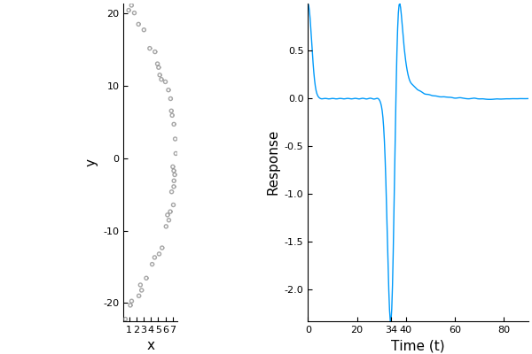

# Lens

the code [lens.jl](lens.jl) arranges particles into the shape of lens. The lens is shaped so that the incident plane wave is completely focused into one point: the listener position.

```julia
include("lens.jl")
plot_lens()
```


The distance of the lens is chosen so that the peak signal should arrive around time 34. Note, as we use a random seed to position the particles, the above figure many vary slightly.
