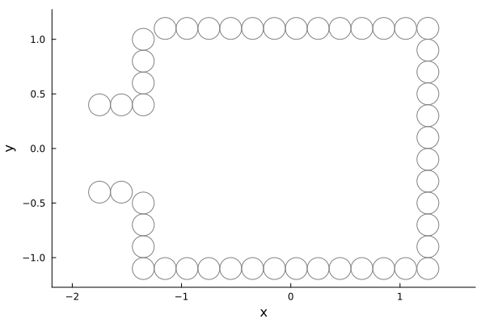
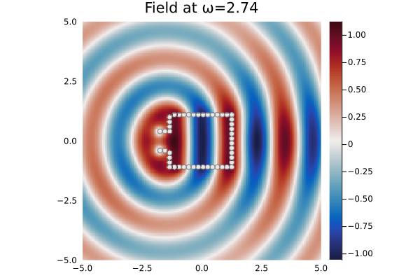

# Helmholtz resonator
---
The code [Resonator.jl](Resonator.jl) simulates a 2D Helmlholtz resonator by aligning particles in the shape of a bottle.

A Helmholtz resonator is made of a cavity with a small opening mouth. When illuminated with an acoustic waves at its specific resonant frequencies, the scattered field inside the cavity reaches high amplitudes. Those frequencies of course depend on the dimensions of the resonator that we set below.

```julia
using MultipleScattering
using Plots

# The four parameters below are all the required dimensions of the resonator.
cavity_radius = 1.0;
cavity_length = 2.5;
mouth_radius = 0.3;
mouth_length = 0.5;
```
To simulate the resonator, we align small circular particles to form a cavity. In the code below, the positions of the particles are stored in the vector X.
```julia
radius = .1; # radius of the particles
d_particle = 2.001*radius; # distance between centers
# define the cavity of the resonator
cavity_up = [
    [x,cavity_radius+radius]
for x = radius:d_particle:cavity_length];
cavity_down = [
    [x,-cavity_radius-radius]
for x = radius:d_particle:cavity_length]

cavity_right = [
    [cavity_length+.05*radius,y]
for y = (- cavity_radius - radius):d_particle:(cavity_radius+2*radius)]

# define the mouth of the resonator
mouth_connect_down = [
    [radius-d_particle,y]
for y=(-cavity_radius-radius):d_particle:(-mouth_radius)]
mouth_connect_up = [
    [radius-d_particle,y]
for y=(mouth_radius+radius):d_particle:(cavity_radius+2*radius)]

mouth_up = [
    [x,mouth_radius+radius]
for x = radius-2*d_particle:-d_particle:-mouth_length-radius]
mouth_down = [
    [x,-mouth_radius-radius]
for x = radius-2*d_particle:-d_particle:-mouth_length-radius]

# put the different pieces together
X = [cavity_up; cavity_down; cavity_right; mouth_connect_down; mouth_connect_up; mouth_up; mouth_down];
X = [x - [cavity_length/2,cavity_radius/2-0.5] for x in X];
```
We finally define the resonator
```julia
particle_medium =  Acoustic(2; ρ = 0., c = 0.);
Resonator = [
    Particle(particle_medium, Circle(x, radius))
for x in X];
plot(Resonator)
savefig("Resonator.png")
```

We then generate the scattered field for incoming plane waves at different frequencies.

```julia
host_medium = Acoustic(2; ρ=1.0, c=1.0); # medium of the background, 2 is the dimension of the setting.
source = plane_source(host_medium; direction = [1.0,0.0])

# region where the result will be plot
M=N=5.0;
bottomleft = [-M;-N]; topright = [M;N];
region = Box([bottomleft, topright]);

sim = FrequencySimulation(Resonator, source);
list_ω = [1.99,3.99,2.74]
result = run(sim, region, list_ω, basis_order=5, only_scattered_waves = true; res=200)
```

We plot the results for the different frequencies and observe that $\omega_0=1.99$ and $\omega_1=3.99$ correspond to resonant frequencies.
```julia
for p=1:3 # loop on the different frequencies
    plot(result, list_ω[p]; seriestype = :heatmap) # clim=(-5.0,5.0)
    colormap("RdBu")
    plot!(Resonator,colorbar=true,
       title="Field at ω="*string(list_ω[p]),axis=false, xguide ="", yguide ="")
    savefig("plot_"*string(p)*".png")
end

```
The following plots are obtained:




