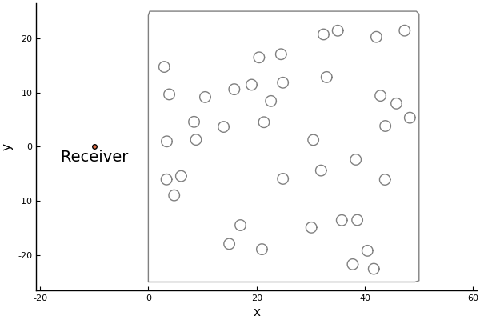
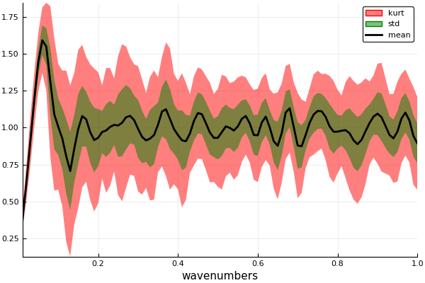
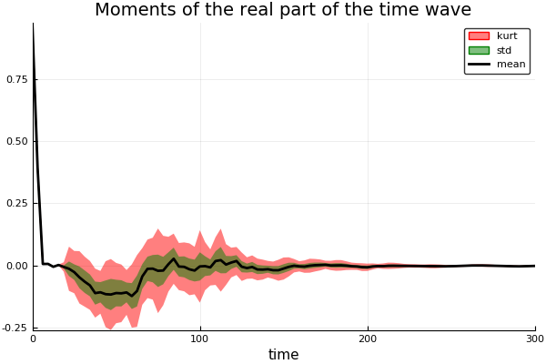

# StatisticalMoments

```@meta
DocTestSetup = quote
    using MultipleScattering
end
```

Here we are going to simulate the scattered wave for many different configurations of particles. We can then take the average and standard deviation (the moments) of the scattered wave. In statistical mechanics this process is called [ensemble average](https://en.wikipedia.org/wiki/Ensemble_average_(statistical_mechanics)).

## Region and particles properties

First we choose the region to place particles and the receiver position:
```jldoctest moments; output = false
using MultipleScattering
bottomleft = [0.0;-25.0]
topright = [50.0;25.0]
shape = Box([bottomleft, topright])
x = [-10.0,0.0]

# output

2-element Array{Float64,1}:
 -10.0
   0.0
```
```julia
using Plots
plot(shape);
scatter!([x[1]],[x[2]], label="");
plot_shape = annotate!([(x[1], x[2] -2., "Receiver")])
```


Next we fill this `shape` with a random (uniform distribution) configuration of particles:
```jldoctest moments
volfrac = 0.05
radius = 1.0

particles = random_particles(Acoustic(2; ρ=0.0, c=0.0), Circle(radius);
        region_shape = shape,
        volume_fraction = volfrac,
        seed=2
);

length(particles)

# output
40
```
To see the position of the chosen particles:
```julia
plot(plot_shape)
plot!(particles);
plot!()
```


Scattering a plane-wave from these particles  
```julia
ωs = LinRange(0.01,1.0,100)
plane_wave = plane_source(Acoustic(1.0, 1.0, 2);
    direction = [1.0,0.0], position = x);
```
```julia
plot(run(particles, plane_wave,x,ωs))
```


## The moments of the scattered wave
Now we will do simulations for particles placed in many different configurations and take the moments:
```julia
results = map(1:20) do i
    particles = random_particles(Acoustic(2; ρ=0.0, c=0.0), Circle(radius);
            region_shape = shape,
            volume_fraction = volfrac,
            seed=i
    )
    run(FrequencySimulation(particles, plane_wave), x, ωs)
end

# package Plots changed it's argument, the below no longer works..
# num_moments = 3
# plot(results; field_apply = real, num_moments = num_moments)
# plot!(xlabel="wavenumbers", title="Moments of the real part")
```


## Calculate the moments of the scattered wave in time
```julia
time_simulations = frequency_to_time.(results)
time_simulations[1].t # the time_arr chosen will be based on the discrete Fourier transform of simulations[1].k_arr
# real_time_moments = StatisticalMoments(time_simulations; response_apply=real) # moments of the real part
# plot(real_time_moments,xlims=(0,300));
# plot!(xlabel="time", title="Moments of the real part of the time wave")
```



## References

A. L. Gower, R. M. Gower, J. Deakin, W. J. Parnell, I. D. Abrahams,
Learning about random media from near-surface backscattering:
using machine learning to measure particle size and concentration,
arXiv preprint,
(2018)1801.05490
