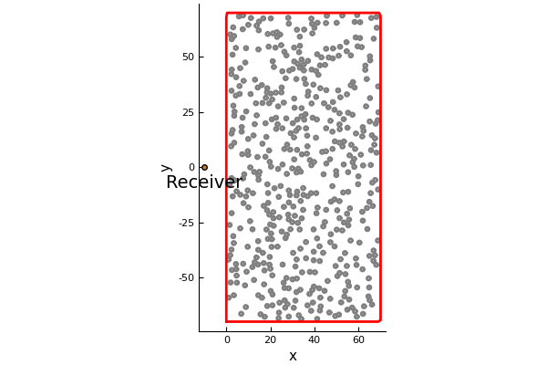
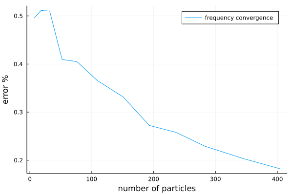
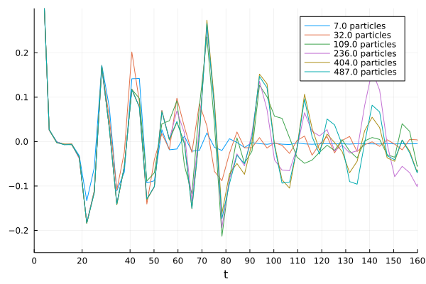
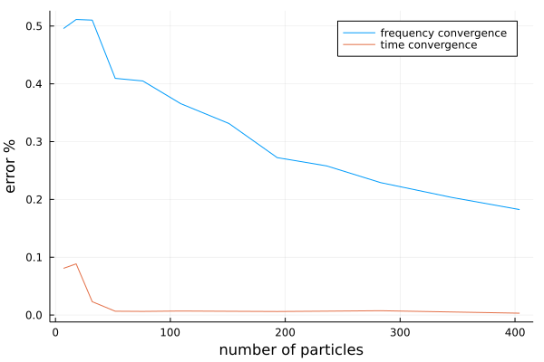
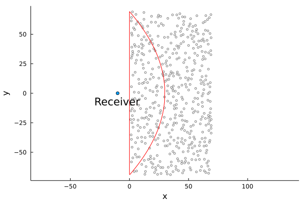
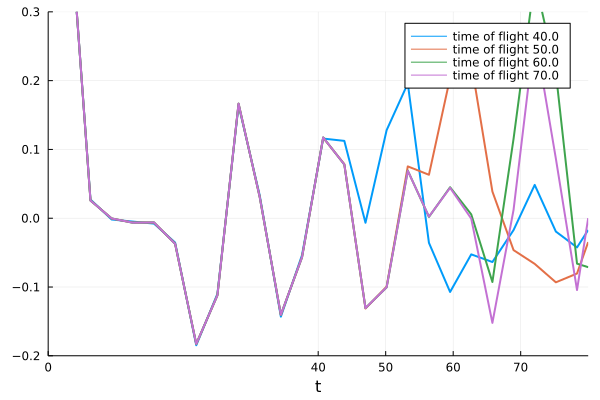

# Near-surface backscattering

Near-surface backscattering is a method of accurately calculating the backscattering from an infinite halfspace. For just the code see [backscattering.jl](backscattering.jl)
First, let us see why it is difficult to approximate the scattering from a halfspace filled with particles. That is, let us find out how many particles are required before the backscattering converges.

## Generate a large material filled with particles.

```julia
using MultipleScattering

host_medium = Acoustic(1.0, 1.0, 2)

radius = 0.8
volfrac = 0.10
max_width = 70.

particle_medium = Acoustic(0.2, 0.1, 2)
particle_shape = Circle(radius)

bottomleft = [0.,-max_width]
topright = [max_width,max_width]

shape = Rectangle(bottomleft,topright)
particles = random_particles(particle_medium, particle_shape; box_shape = shape, volume_fraction = volfrac)
```

We send an incoming harmonic plane wave and receive the backscattering at `x`:
```julia
using Plots
pyplot(linewidth=2)

x = [-10.,0.]
source =  plane_source(host_medium; position = x,
        direction = [1.0,0.],
        amplitude = 1.0)

plot(particles)
scatter!([x[1]],[x[2]], lab="")
annotate!([(x[1], x[2] -max_width/10., "Receiver")])
plot!(shape, linecolor = :red)
```


## Calculate backscattering for different quantity of particles
We will shave off particles on the right of this group of particles (above), and then calculate the backscattered waves for a range of angular frequencies `ωs`.
```julia
ωs = collect(0.01:0.01:1.)
widths = 10.:5.:max_width
num_particles = zeros(length(widths))

results = map(eachindex(widths)) do i
    bottomleft = [0.,-widths[i]]
    topright = [widths[i],widths[i]]
    shape = Rectangle(bottomleft, topright)

    ps = filter(p -> p ⊆ shape, particles) # select particles that are inside shape
    num_particles[i] = Int(length(ps))

    simulation = FrequencySimulation(host_medium, ps, source)
    run(simulation, x, ωs)
end

backscattered_waves = field.(results)

M = length(backscattered_waves)
bM = backscattered_waves[M] # backscattering from largest material
differences = [norm(b - bM) for b in backscattered_waves[1:(M-1)]]./norm(bM)

plot_converge = plot(num_particles[1:(M-1)], differences,
    xlabel = "number of particles", ylabel ="error %",
    label="frequency convergence"
)
```


The graph shows the rate of convergence, that is, how much the backscattering changes when including more particles (making the material deeper). The graph has not clearly converged, so we can only conclude that more than 400 particles are needed to accurately approximate the backscattering from an infinite halfspace.

We can accelerate this convergence by considering backscattering in time.

## Calculate backscattering in time
```julia
time_simulations = frequency_to_time.(results)
receiver = results[1].x[1]
times = 2*(widths .- receiver[1]) # time it takes for an incident plane wave to reach the furthest particles and then return to the receiver

plot()
for i in [1,3,6,9,12,13]
    plot!(time_simulations[i],label="$(num_particles[i]) particles"
        , xlims=(0,maximum(times)+10.), ylims=(-0.2,0.1)
        , xticks = [0.; 30.; times]
    )
end
gui()
```


We see that the responses in time diverge from each other more and more as time goes by. Meaning that if we only calculate the response for a short amount of time `34`, then the convergence will be accelerated.

```julia
time_vec = 0.:pi:34.2
time_results = frequency_to_time.(results; t_vec = time_vec, impulse = GaussianImpulse(maximum(ωs)))

backscattered_waves = field.(time_results)
bM = backscattered_waves[M] # backscattering from largest material
differences = [norm(b - bM) for b in backscattered_waves[1:(M-1)]]./norm(bM)
plot(plot_converge)
plot!(num_particles[1:(M-1)], differences, xlabel = "number of particles", ylabel ="error %", label="time convergence")
```


The convergence of the time response, for time `0<t<34`, is much faster. In fact, less than 100 particles are needed to accurately approximate the backscattering from an infinite halfspace. The reason we don't show these as log plots is because there is a small constant error (about `0.01%`) due to the discrete Fourier transform. This error is caused by the Gibbs phenomena and by assuming the backscattering is periodic (when it is not). Both these errors are well understood and can be controlled.

## Calculate backscattering only from near-surface particles
This last step is about efficiency. We want to only include particle which contribute to the backscattering for short time intervals. To do this we created a region called `TimeOfFlight(listener,time)`, where every particle in this shape takes less than `time` for their first scattered wave (due to an incident plane wave) to return to the `listener.`  More precisely, if `listener = (lx,ly)`, then every point `(x,y)` inside this shape satisfies:
`x-lx+((x-lx)^2+(y-ly)^2)^(1/2)<time` and `x>0`.

For example, look at the largest quantity of particle we used

```julia
listener_position = [-10.,0.]
shape = TimeOfFlight(listener_position,80.0)
scatter([listener_position[1]],[listener_position[2]]);
annotate!([(listener_position[1], listener_position[2] -max_width/10., "Receiver")])
plot!.(particles);
plot!(shape)
```


For time `0<t<80` the backscattering from these particles is the same as an infinite halfspace filled with particles. To achieve this result we need only the particles inside the shape `TimeOfFlight` (region with the red outline). The particles outside this shape were unnecessary. To see this inaction:
```julia
times = 40.:15.:80.
near_surface_simulations = map(times) do t
    shape = TimeOfFlight(receiver,t) # choose a material with particles only in the near surface region
    ps = filter(p -> p ⊆ shape, particles) # select particles that are inside shape
    run(FrequencySimulation(host_medium, ps, source), x, ωs) # calculate backscattering
end

time_near_simulations = frequency_to_time.(near_surface_simulations; impulse = GaussianImpulse(maximum(ωs)))

plot()
for i in 1:length(times)
    plot!(time_near_simulations[i],label="time of flight $(times[i])"
        , xlims=(0,maximum(times)+10.), ylims=(-0.6,0.3)
        , xticks = [0.; times], title=""
    )
end
gui()
```


Note the incident pulse has a thickness of about `10` in time, which is why the `time of flight 40` diverges from the other curves slightly before time `40`, and likewise for the other curves.
