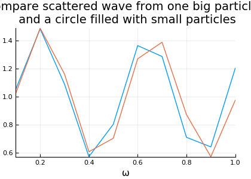

# Random particles in a circle

The code [particles_in_circle.jl](particles_in_circle.jl) compares the scattered wave from one big circle, with the scattered wave from a circle filled with small particles.

```julia
using MultipleScattering

#You can also pick your own shape, an generate random particles inside it
#with a certain radius ands volume fraction
radius = 0.3
volfrac = 0.45
centre = [0.,0.]
big_radius = 3.0

particle_medium = Acoustic(2; ρ=0.0, c=0.0) # 2D particle with density ρ = 0.0 and soundspeed c = 0.0
particle_shape = Circle(radius)

circle = Sphere(centre, big_radius)

particles = random_particles(particle_medium, particle_shape; region_shape = circle, volume_fraction = volfrac, seed=1)

x = [-10.,0.] # position to receive the reflected wave
host_medium = Acoustic(2; ρ=1.0, c=1.0)
source =  plane_source(host_medium; position = x, direction = [1.0,0.])
simulation = FrequencySimulation(particles, source)
```
The particles chosen are impenetrable, i.e. the wave is 100\% reflected. So this circle filled with scatterers should act like one big particle.
```julia
big_particle = Particle(particle_medium, circle)
big_particle_simulation = FrequencySimulation([big_particle], source)

#define a bounding box for plot
    bottomleft = [-10, -2*big_radius]
    topright = [big_radius, 2*big_radius]
    box = Box([bottomleft, topright])

using Plots
height = 300
#gr(size=(1.4*height,height))
pyplot(leg=false, size=(1.4*height,height))

ω = 0.5
#plot(big_particle_simulation, ω; res=15, bounds = box);
#plot!(big_particle)

#savefig("plot_field_big.png")

#plot(simulation, ω; res=15, bounds = box);
#plot!(particles, linecolor = :green)

#savefig("plot_field.png")
```
Resulting in the figures:


If we compare the response measured at the listener `[-10., 0.]`, they should be very similar:
```julia
#define angular frequency range
ωs = collect(LinRange(0.1,1.0,10))
result = run(simulation, x, ωs)
big_result = run(big_particle_simulation, x, ωs)

#plot(result, lab = "scattering from particles")
#plot!(big_result,
#    lab = "scattering from big particle",
#    title="Compare scattered wave from one big particle, \n and a circle filled with small particles")
```


