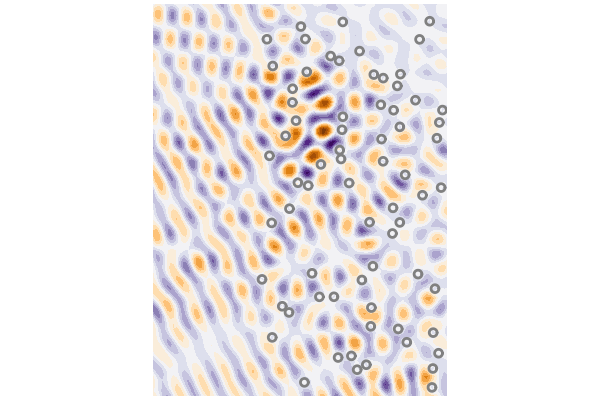

# Make a gif of a time-harmonic wave

```julia
using MultipleScattering
using Plots; pyplot(linewidth=2.0)

num_particles = 70
radius = 1.0
ω = 1.0

host_medium = Acoustic(1.0, 1.0, 2)
particle_medium = Acoustic(0.2, 0.3, 2)
particle_shape = Circle(radius)

max_width = 50*radius
bottomleft = [0.,-max_width]
topright = [max_width,max_width]
shape = Rectangle(bottomleft,topright)

particles = random_particles(particle_medium, particle_shape; region_shape = shape, num_particles = num_particles)

source =  plane_source(host_medium; direction = [1.0,0.5])

simulation = FrequencySimulation(particles, source)

bottomleft = [-25.,-max_width]
bounds = Rectangle(bottomleft,topright)
result = run(simulation, bounds, [ω]; res=100)

ts = LinRange(0.,2pi/ω,30)

maxc = round(10*maximum(real.(field(result))))/10
minc = round(10*minimum(real.(field(result))))/10

anim = @animate for t in ts
    plot(result,ω; seriestype = :contour, time=t, clim=(minc,maxc), c=:balance)
    plot!(simulation)
    plot!(colorbar=false, title="",axis=false, xlab="",ylab="")
end
#
gif(anim,"backscatter_harmonic.gif", fps = 7)
```

