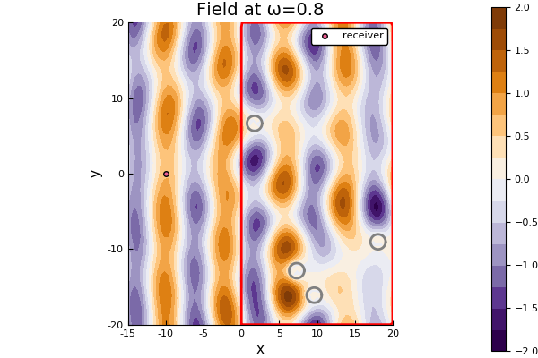

# Simple random particles example

```

## Define particle properties
Define the volume fraction of particles, the region to place the particles, and their radius
```julia
using MultipleScattering
num_particles = 4
radius = 1.0

particle_medium = Acoustic(2; ρ=0.2, c=0.1) # 2D particle with density ρ = 0.2 and soundspeed c = 0.1
particle_shape = Circle(radius)

max_width = 20*radius
bottomleft = [0.,-max_width]
topright = [max_width,max_width]
region_shape = Rectangle(bottomleft,topright)

particles = random_particles(particle_medium, particle_shape; region_shape = region_shape, num_particles = num_particles)
```

Now choose the receiver position `x`, the host medium, set plane wave as a source wave, and choose the angular frequency range `ωs`
```julia
x = [-10.,0.]
host_medium = Acoustic(2; ρ=1.0, c=1.0)
source =  plane_source(host_medium; position = x, direction = [1.0,0.])

ωs = LinRange(0.01,1.0,100)

simulation = FrequencySimulation(particles, source)
result = run(simulation, x, ωs)
```

We use the `Plots` package to plot both the response at the listener position x

```julia
    using Plots; #pyplot(linewidth = 2.0)
    plot(result, apply=real) # plot result
    plot!(result, apply=imag)
    #savefig("plot_result.png")
```


And plot the whole field inside the region_shape `bounds` for a specific wavenumber (`ω=0.8`)
```julia
    bottomleft = [-15.,-max_width]
    topright = [max_width,max_width]
    bounds = Rectangle(bottomleft,topright)

    plot(simulation,0.8; res=80, bounds=bounds)
    plot!(region_shape, linecolor=:red)
    plot!(simulation)
    scatter!([x[1]],[x[2]], lab="receiver")

    #savefig("plot_field.png")
```

## Things to try
- Try changing the volume fraction, particle radius and ω values we evaluate

