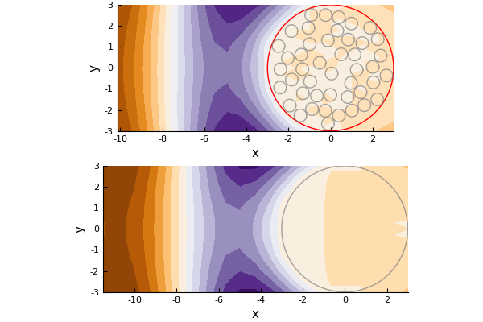
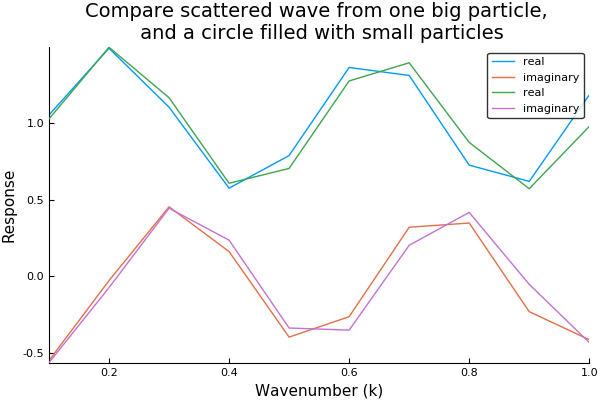

# Random particles in a circle

The code [particles_in_circle.jl](particles_in_circle.jl) compares the scattered wave from one big circle, with the scattered wave from a circle filled with small particles.

```julia
using MultipleScattering

k_arr = collect(LinRange(0.1,1.0,10))

# You can also pick your own shape, an generate random particles inside it
# with a certain radius ands volume fraction
radius = 0.3
volfrac = 0.45
centre = [0.,0.]
big_radius = 3.0

circle = Circle(big_radius,centre)
circle_simulation = FrequencySimulation(volfrac,radius,k_arr;shape=circle)
```
The particles chosen are impenetrable, i.e. the wave is 100\% reflected. So this circle filled with scatterers should act like one big particle.
```julia
big_particle = Particle(centre,big_radius)
big_particle_simulation = FrequencySimulation([big_particle], k_arr; hankel_order=15)

using Plots
plot(
    plot(circle_simulation,0.5; drawshape=true, drawlisteners =false),
    plot(big_particle_simulation,0.5; drawlisteners =false),
    layout = (2,1)
)
```


If we compare the response measured at the listener `[-10., 0.]`, they should be very similar:
```julia
plot(circle_simulation)
plot!(big_particle_simulation,title="Compare scattered wave from one big particle, \n and a circle filled with small particles")
```

