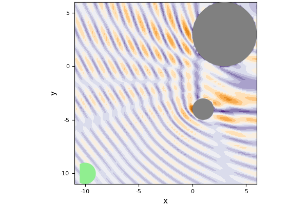

# OUT-DATED needs to be updated

# Two particles

Define two particles with the first centred at [1.,-2.], with radius 1.0, sound speed 2.0 and density 10.0
```julia
using MultipleScattering
using Plots
pyplot()

p1 = Particle([1.,-4.], 1.0; c = 20.0+0.0im, ρ = 10.)
p2 = Particle([3.,3.],  3.0; c = 1.0+0.0im, ρ = 0.1)
particles = [p1,p2]
```

Specify the angular frequency of the incident wave and calculate the response
```julia
w_arr = collect(0.1:0.01:1.)
simulation = FrequencySimulation(particles, w_arr)
plot(simulation)
```


The above used an incident plane with the default reciever/listener position and incident plane wave direction
```julia
simulation.listener_positions
simulation.source_direction
```
to change these defaults use
```julia
simulation = FrequencySimulation(particles, w_arr;
    listener_positions = [-10.,-10.],
    source_direction=[1.,1.])
```
then plot the response around the particles and receiver
```julia
w = 3.2
plot(simulation,w; res=80, resp_fnc=abs)
```


the green circle in the plot is the receiver position. Looking at the region between the particles we see the complicated results of multiple scatttering.
