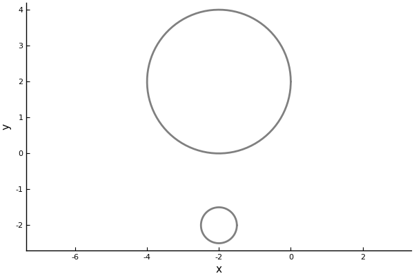
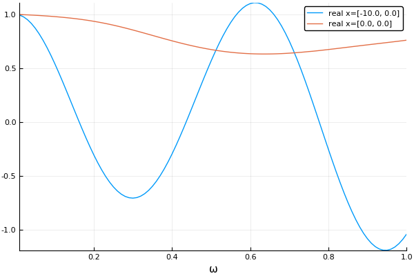
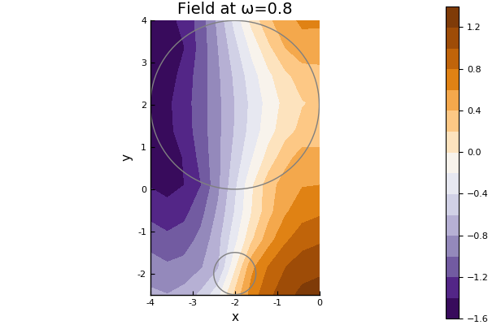
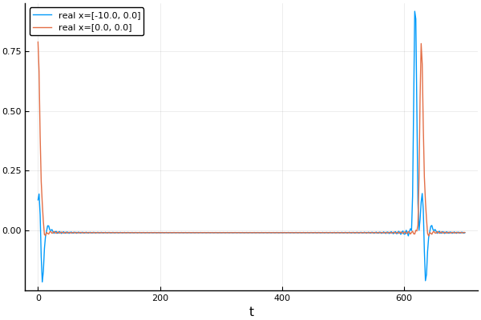

# Introduction


### [Physical properties wave](@id into_physical_properties)

First define the host medium, for example for an acoustic medium in 2D

```@meta
DocTestSetup = quote
    using MultipleScattering
end
```

```jldoctest intro
julia> host_medium = Acoustic(2; ρ=1.0, c=1.0) # density ρ = 1.0 and soundspeed c = 1.0
Acoustic(1.0, 1.0 + 0.0im, 2)
```
At this step we have restricted the physics to acoustics, that is, solutions to the Helmholtz equation: $\nabla^2 u(x,y,\omega) + k^2 u(x,y,\omega) = 0$, where $k = \omega/c$, $\omega$ is the angular frequency and $c$ the sound speed of the medium.

### [Source wave](@id into_source)

The host medium will determine the types of waves that can propagate. For example an incident plane wave $\mathrm e^{ \mathrm i k x}$ there is a convenient constructor
```jldoctest intro
julia> source = plane_source(host_medium; direction = [1.0,0.0]);
```
!!! note
    Often $\mathrm e^{ \mathrm i k x - \mathrm i \omega t}$ is considered to be a harmonic plane-wave travelling along the $x-$axis. We omit the part $ - \mathrm i \omega t$ as is common in frequency space.  


We generally call the incident wave a source. See [Sources](@ref) for details, and see [Acoustic](@ref) for some functions for the `Acoustic` medium.

### [Particles](@id into_particles)

Next, we define some particles to scatter an acoustic wave. We choose two filled circles, the first centred at [-2,2] with radius 2 and the second at [-2,-2] with radius 0.5,
```jldoctest intro
julia> particle_medium =  Acoustic(2; ρ=10.0, c=2.0); # 2D acoustic particle with density ρ = 10.0 and soundspeed c = 2.0

julia> p1 = Particle(particle_medium, Circle([-2.0,2.0], 2.0))
Particle(Acoustic(10.0, 2.0 + 0.0im, 2), Circle((-2.0, 2.0), 2.0))

julia> p2 = Particle(particle_medium, Circle([-2.0,-2.0], 0.5))
Particle(Acoustic(10.0, 2.0 + 0.0im, 2), Circle((-2.0, -2.0), 0.5))

julia> particles = [p1,p2];
```
See [Shapes](@ref) and [Particles](@ref) for details on different shapes and particles.

If you have the package `Plots` installed you can plot the particles. Note that although they appear hollow, we consider them to filled with the same homogenous material.
```julia
julia> using Plots; pyplot();

julia> plot(particles);
```
!!! note

    Most things in this package can be plotted just by typing `plot(thing)`. However you need to have `Plots` installed, and you may need to use the backend `pyplot()`. See [Plotting](@ref) for details on plotting.



### Simulation and results

Once we know the medium, the particles, and the have these three components, we can build our `FrequencySimulation` object
```jldoctest intro
julia> simulation = FrequencySimulation(particles, source);
```

To get numerical results, we run our simulation for specific positions and angular frequencies,
```jldoctest intro
julia> x = [[-10.0,0.0], [0.0,0.0]];

julia> max_ω = 1.0;

julia> ωs = 0.01:0.01:max_ω;

julia> result = run(simulation, x, ωs);
```

We can plot the time-harmonic response across the frequencies `ωs` wavenumbers and at the location (-10,0) by typing:
```julia
julia> plot(result)
```


For a better overview you can calculate the response for lots of points `x` in the domain and then plot the whole field for one frequency `ω` by typing:
```julia
julia> ω = 0.8;

julia> plot(simulation, ω);

julia> plot!(particles)
```


For details on plot fields and videos see [Plotting](@ref).

### Results in time

If we have calculated a frequency response $\hat u(\omega)$ over a range of frequencies $\omega$, then we can use a Fourier transform to calculate the response in time $u(t)$. That is, we can calculate $u(t)$ by approximating the Fourier transform:

$u(t) = \frac{1}{2\pi} \int_{-\infty}^\infty \hat u(\omega)\mathrm e^{-\mathrm i \omega t} d\omega.$

For details see the section on [Time response](@ref). For example, taking a Discrete Fourier transform of the previous response leads to an incident plane wave pulse in time:

```julia
julia> time_result = frequency_to_time(result);

julia> plot(time_result)
```


In the image above the first peak on the left is due to the incident wave (the source), and the second peak is the wave scattered by the`particles`. Note how both peaks are quite jagged. This is due to [Gibb's phenomena](https://en.wikipedia.org/wiki/Gibbs_phenomenon). To resolve this we can use a Gaussian impulse function shown below. See [Time response](@ref) for more details.
```julia
julia> t_vec = LinRange(0.,700.,400);

julia> gauss_time_result = frequency_to_time(result; t_vec = t_vec, impulse = GaussianImpulse(max_ω));

julia> plot(gauss_time_result)
```

