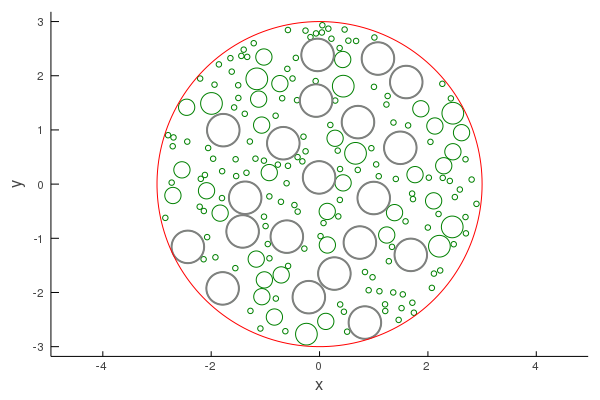

# Particles

```@meta
DocTestSetup = quote
    using MultipleScattering
end
```
[`Particle`](@ref) is a `struct` which define a scatterer, obstacle, or simply particle, which can scatter waves. See [Particle](@ref base_particle) for a list of relevant types and functions.

A `Particle` have two fields: `medium` and `shape`. The `medium` defines what kind of waves can propagate inside `Particle`, and what type of `RegularSource` can be used to scatter waves from `Particle`. One example `medium` is [Acoustic](@ref). The `shape` completely defines the geometry and position of the particle, see [Shapes](@ref) for details.

For an example we can define a circular particle with acoustics medium:
```jldoctest intro; output = false
using MultipleScattering;

mymedium = Acoustic(2; ρ = 10.0, c = 2.0); # 2D acoustics with density ρ = 10.0 and soundspeed c = 2.0
myshape = Sphere([-2.0, 2.0], 2.0);
p1 = Particle(mymedium, myshape);
MultipleScattering.shape(p1) # we use "MultipleScattering." just in case the function shape is already defined

# output
Sphere{Float64, 2}([-2.0, 2.0], 2.0)
```

## Placing particles in a region

Suppose we want to place many circular particles in a region. The region has to be a pre-defined `Shape`, for example a `Circle`:
```julia
# Define the region
centre = [0.0, 0.0];
big_radius = 3.0;
circle = Sphere(centre, big_radius);

# Define the particle geometry and medium
p_radius = 0.3;
myshape = Circle(p_radius); # we do not specify centre as it is not used by random_particles
mymedium = Acoustic(2; ρ = 10.0, c = 2.0);

# Generate particles inside circle
volfrac = 0.2;
particles = random_particles(mymedium, myshape;
    region_shape = circle,
    volume_fraction = volfrac,
    seed = 1
);

using Plots;

plot(particles)
plot!(circle, linecolor = :red)
```


## Placing polydisperse particles in a region

Similar to the above, we can place particles with a range of shapes.

Suppose we want to add to the above example a range of smaller particles:
```julia

# Define a range of particles sizes
rs = [0.05, 0.15, 0.15, 0.2]; # by repeating the radius 0.15 twice, there will be twice as many particles with this radius.
myshapes = Circle.(rs);
mymedium = Acoustic(2; ρ = 0.2, c = 0.2);

# Generate particles inside circle
volfrac = 0.15
polydisperse_particles = random_particles(mymedium, myshapes;
    current_particles = particles,
    region_shape = circle,
    volume_fraction = volfrac,
    seed = 1
);

plot(polydisperse_particles, linecolor = :green)
plot!(particles, linewidth = 2.0)
plot!(circle, linecolor = :red)
```


## Removing particles

Say we want to place a point-source within region filled with particles. To avoid placing the source inside any particle, we can remove a small region of particles:
```julia
small_circle = Circle(1.2);

filter!(p -> !(p ⊆ small_circle), polydisperse_particles)

plot(polydisperse_particles, linecolor = :green)
plot!(circle, linecolor = :red)
```


Next we place a point source in the centre and plot the result, while excluding a small region `Circle(0.1)` to avoid the singularity caused by a point source:
```julia
ω = 0.4;
point_wave = point_source(Acoustic(2; ρ = 1.0, c = 1.0), [0.0, 0.0]);
sim = FrequencySimulation(polydisperse_particles, point_wave);
plot(sim, ω;
        res = 20,
        exclude_region = Circle(0.1),
        drawparticles = true
)
```


## Particle internals

To define the scattering from a particle we use the T-matrix method. This package only exports T-matrix for circular [`Particle`](@ref)  and circular [`CapsuleParticle`](@ref). To understand how to define new T-matrix read [Notes on the T-matrix](../maths/multiplescattering.pdf) and see the source code of [`t_matrix`](@ref).
