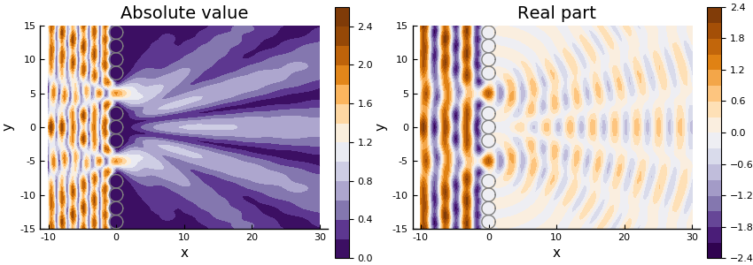
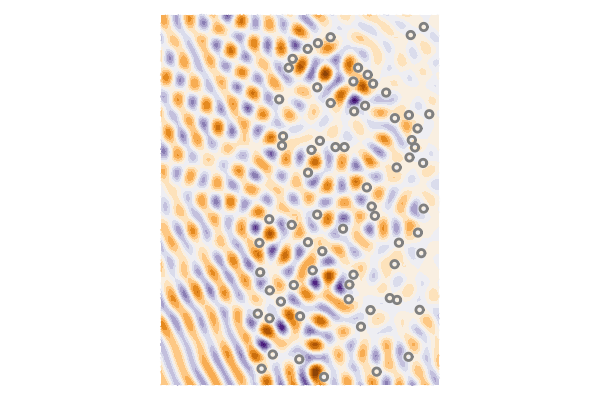

# Plotting

The plotting for this package is supplied by the package [Plots](http://docs.juliaplots.org). The options and keywords used for the package Plots can be used for the plots in this package.

Below are examples of plotting the whole field in frequency (harmonic wave) and time. The examples require the package `Plots` and, mostly, `PyPlot`.

## Field - Harmonic two gaps
```julia
using MultipleScattering
using Plots; pyplot(size = (800,300))

radius = 1
ω = 2.0

host_medium = Acoustic(1.0, 1.0, 2)
particle_medium = Acoustic(0.0, 0.0, 2)

# Create a wall of particles
particles = [
  Particle(particle_medium, Sphere([0.,y],1.0))
for y = -40:2*radius:40.]

# Make two gaps in the wall
deleteat!(particles,[18,19,23,24])

# Define region to plot
bottomleft = [-10.;-15.]
topright = [30.;15.]
region = Box([bottomleft, topright])

# Calculating scattering for a plane wave
source =  plane_source(host_medium; direction = [1.0,0.0])

# You can skip the step of defining FrequencySimulation
result = run(particles, source, region, [ω]; res=100)

plot(result,ω;
    field_apply = abs, seriestype = :contour,
    title = "Absolute value"
  );
p1 = plot!(particles, ylims = (-15.0,15.0));  
plot(result,ω;
    field_apply = real, seriestype = :contour,
    title = "Real part"
);
p2 = plot!(particles, ylims = (-15.0,15.0));
plot(p1, p2)

# savefig("gap-diffraction.png")
```


## Movie - Harmonic two gaps
Continuing from [Field - Harmonic two gaps](@ref), the previous example, we can plot how the harmonic field oscillates in time. That is, to get the harmonic field at time $t$ we just multiple the field by $\mathrm e^{-\mathrm i \omega t}$ for every $\mathbf x$. For example, the plane wave $\mathrm e^{\mathrm i x k}$ would become $\mathrm e^{\mathrm i x k -\mathrm i \omega t}$.   

```julia
pyplot(size = (450,300))

ts = LinRange(0.,2pi/ω,30)

maxc = round(10*maximum(real.(field(result))))/10
minc = round(10*minimum(real.(field(result))))/10

anim = @animate for t in ts
    plot(result,ω; seriestype = :contour,
        phase_time=t, clim=(minc,maxc),
        ylims = (-15.0,15.0) , c=:balance
    )
    plot!(particles)
    plot!(colorbar=false, title="",axis=false, xguide ="",yguide ="")
end
# gif(anim,"gap-diffraction.gif", fps = 7)
```


## Movie - Time impulse plane-wave - two gaps
Continuing from [Field - Harmonic two gaps](@ref), we can plot how an impulse plave-wave in time passes through two gaps. See [Time response](@ref) for more details on the code used below.

```julia
pyplot(size = (450,300))
ωs = LinRange(0.0,2.0,300)[2:end] # avoid using ω = 0

# We use a lower resolution (resolution = 50) as this is a heavier calculation
result = run(particles, source, region, ωs; resolution = 50)

# Calculate time response over rect
t_max = 0.75 .* real(region.width / host_medium.c)
ts = LinRange(0.0,t_max,75)
impulse = GaussianImpulse(maximum(ωs)*0.6)
timres = frequency_to_time(result; t_vec = ts, impulse = impulse)

maxc = round(10*maximum(field(timres)))/10
minc = round(10*minimum(field(timres)))/10

# timres = TimeSimulationResult(timres.field .+ max_c/100.0 , timres.x, timres.t)

ylims =  (-region.height/2,region.height/2)
anim = @animate for t in ts
    plot(timres,t,seriestype=:contour,
      clim = (minc, maxc),
      leg = false, ylims = ylims
    )
    plot!(particles)
    plot!(frame = :none, title="", xguide ="",yguide ="")
end

# gif(anim,"gap-diffraction.gif", fps = 7)
```


## Movie - Harmonic from random particles

```julia
using MultipleScattering
using Plots; pyplot()

num_particles = 70
radius = 1.0
ω = 1.0

host_medium = Acoustic(1.0, 1.0, 2)
particle_medium = Acoustic(0.2, 0.3, 2)
particle_shape = Circle(radius)

max_width = 50*radius
bottomleft = [0.,-max_width]
topright = [max_width,max_width]
shape = Box([bottomleft,topright])

particles = random_particles(particle_medium, particle_shape; region_shape = shape, num_particles = num_particles)

source =  plane_source(host_medium; direction = [1.0,0.5])

simulation = FrequencySimulation(particles, source)

bottomleft = [-25.,-max_width]
bounds = Box([bottomleft,topright])
result = run(simulation, bounds, [ω]; res=100)

ts = LinRange(0.,2pi/ω,30)

maxc = round(10*maximum(real.(field(result))))/10
minc = round(10*minimum(real.(field(result))))/10

anim = @animate for t in ts
    plot(result,ω; seriestype = :contour, phase_time=t, clim=(minc,maxc), c=:balance)
    plot!(simulation)
    plot!(colorbar=false, title="",axis=false, xguide ="",yguide ="")
end
# gif(anim,"backscatter_harmonic.gif", fps = 7)
```

