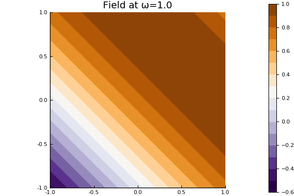
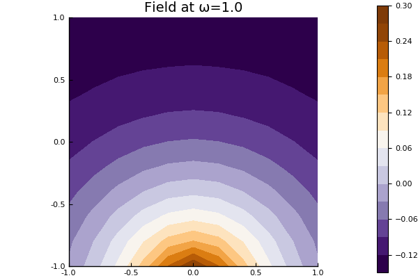
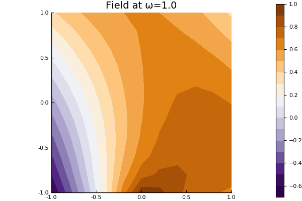
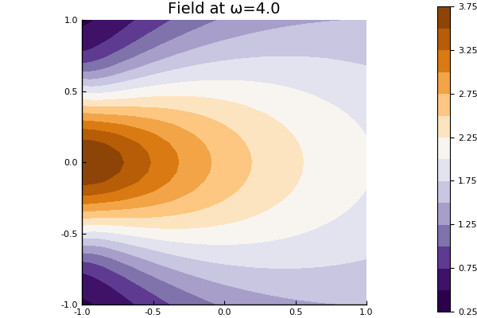

# Sources

```@meta
DocTestSetup = quote
    using MultipleScattering
end
```
[`Source`](@ref) is a `struct` which represents any source, also called an incident wave. For acoustics, any wave field $u_{\text{in}}(x,y)$ that satisfies $\nabla^2 u_{\text{in}}(x,y) + k^2 u_{\text{in}}(x,y) = 0$, with $k = \omega/c$, can be a source. See [Source](@ref source_base) for a list of relevant types and functions.

## 2D Acoustics

Two common source waves are shown below.

For a plane-wave of the form $u_{\text{in}}(x,y) = A \mathrm e^{\mathrm i k \mathbf n \cdot (\mathbf x - \mathbf x_0)}$, where $A$ is the amplitude, $\mathbf n = (n_1,n_2)$ is the direction of propagation, and $\mathbf x_0 = (x_0,y_0)$ is the initially position of the source, we can use
```jldoctest intro
julia> medium = Acoustic(1.0, 1.0, 2);

julia> A = 1.0;

julia> n = [1.0,1.0];

julia> x0 = [1.0,0.0];

julia> plane_wave = plane_source(medium; amplitude = A, direction = n, position = x0);
```

We can plot this source wave one frequency ω by using
```julia
julia> ω = 1.0;

julia> domain = Rectangle([-1.0,-1.0],[1.0,1.0]);

julia> plot(plane_wave, ω; bounds = domain)
```


Another useful source is the point source $u_{\text{in}}(x,y) = \frac{\mathrm i A}{4} \mathrm H_0^{(1)}(k \|(x-x_0,y-y_0)\|)$ where $A$ is the amplitude,  $\mathbf x_0 = (x_0,y_0)$ is the origin of the point source, and $\mathrm H_0^{(1)}$ is the Hankel function of the first kind.

```jldoctest intro
julia> x0 = [0.0,-1.2];

julia> domain = Rectangle([-1.0,-1.0],[1.0,1.0]);

julia> point_wave = point_source(medium, x0, A);
```
```julia
julia> plot(point_wave, ω; bounds = domain)
```


!!! note
    Because the point source has a singularity at $x_0$ it is best to avoid plotting, and evaluating the field, close to $x_0$.

## Creating new sources

The easiest way to create new sources is to just sum together predefined sources:

```julia
julia> source = (3.0 + 1.0im) * point_wave + plane_wave;

julia> plot(source, ω; bounds = domain)
```


For example, to create a finite emitter/transducer source we can use:
```julia
julia> ys = LinRange(-0.7, 0.7, 30);

julia> source = sum(ys) do y point_source(medium, [-1.1, y]) end;

julia> plot(source, 4.0; bounds = domain, field_apply = abs, res = 40)
```


where `field_apply` is applied to the wave field at every point, the default is `field_apply = real`, and `res` is the resolution along both the $x$ and $y$ axis.

To define a new source you will need to understand the internals below.

## Source internals

The `struc` [`Source`](@ref) has three fields: `medium`, `field`, and `coef`, explained with examples below:
```jldoctest intro
julia> plane_wave = plane_source(Acoustic(1.0, 1.0, 2); direction = [1.0,0.0]);

julia> plane_wave.medium # the physical medium
Acoustic(1.0, 1.0 + 0.0im, 2)

julia> x = [1.0,1.0]; ω = 1.0;

julia> plane_wave.field(x,ω) # the value of the field
0.5403023058681398 + 0.8414709848078965im
```

To calculate the scattering from a particle due to a source, we need the coefficients $a_n(\mathbf x_0, \omega) = $ Source.coef(x0,ω). We use these coefficients to represent the source in a radial coordinate system. That is, for any origin $\mathbf x_0$, we need to represent the incident wave $u_{\text{in}}(\mathbf x)$ using a series or regular waves

$u_{\text{in}}(\mathbf x) = \sum_n a_n(\mathbf x_0, \omega) \mathrm v_n(\mathbf x - \mathbf x_0),$  

where for the scalar wave equation:

$\mathrm v_n(\mathbf x) = \begin{cases}
   \mathrm J_n(k r) \mathrm e^{\mathrm i \theta n} & \text{for } \mathbf x \in \mathbb R^2, \\
   \mathrm j_\ell(k r) \mathrm Y_\ell^m(\hat{\mathbf x}) & \text{for } \mathbf x \in \mathbb R^3,\\
\end{cases}$

where for the first case $(r,\theta)$ are the polar coordinates and $n$ sums over $-N,-N+1, \cdots, N$, where $N$ is the basis order, and $\mathrm J_n$ is a Bessel function.
For the second case, we use a spherical coordinates with $r = \| \mathbf x\|$ and $\hat{\mathbf x} = \mathbf x/\|\mathbf x\|$, $n$ denotes the multi-index $n=\{\ell,m\}$ with summation over $\ell = 0, 1, \cdots,N$ and $m=-\ell,-\ell+1,\ell$, $\mathrm j_\ell$ is a spherical Bessel function, and $\mathrm Y_\ell^m$ is a spherical harmonic.

Both the inbuilt plane and point sources have functions `coef` which satisfy the above identity, for example
```jldoctest intro
julia> using LinearAlgebra, SpecialFunctions;

julia> medium = Acoustic(2.0, 0.1, 2);

julia> source = plane_source(medium);

julia> x0 = [1.0,1.0]; ω = 0.9;

julia> x = x0 + 0.1*rand(2); basis_order = 10;

julia> vs = regular_basis_function(medium, ω);

julia> source.field(x,ω) ≈ sum(source.coef(basis_order,x0,ω) .* vs(basis_order, x - x0))
true
```

The package also supplies a convenience function `source_expand`, which represents the source in terms of regular waves, for example:  
```jldoctest intro
julia> source2 = source_expand(source, x0; basis_order = 10);

julia> source.field(x,ω) ≈ source2(x,ω)
true
```
