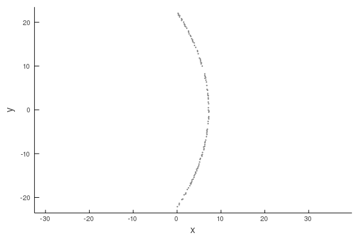

# Time response

```@meta
DocTestSetup = quote
    using MultipleScattering
end
```

This package calculates all scattering in the frequency domain, and we call the resulting field the frequency response $\hat u(\mathbf x,\omega)$, which satisfies $\nabla^2 \hat u(\mathbf x,\omega) + k^2 \hat u(\mathbf x,\omega) = 0$, where $k = \dfrac{\omega}{c}$. We can transform the frequency response $\hat u(\mathbf x,\omega)$ into a time response $u(\mathbf x,t)$ using a Fourier transform, where $u(\mathbf x,t)$ satisfies $\nabla^2 u(\mathbf x,t) - \frac{1}{c^2}  \frac{\partial^2}{\partial t^2}u(\mathbf x,t) = 0$. For a minimal example see [Results in time](@ref), or see [Technical details](@ref impulse_details) for more maths.

!!! note
    The package assumes the time response $u(\mathbf x,t)$ is always real, this simplifies the Fourier transform.

## [Intro](@id impulse_intro)

As an example, let use a plane-wave source $\mathrm e^{\mathrm i \omega x}$ and measure the response at origin of the source $x = (0,0)$,
```jldoctest time; output = false, filter = r".*"s
using MultipleScattering;

plane_wave = plane_source(Acoustic(1.0, 1.0, 2); direction = [1.0, 0.0], position = [0.0, 0.0]);
x = [[0.0, 0.0]];
ωs = LinRange(0.0, 1.0, 100);
freq_response = run(plane_wave, x, ωs);
t_vec = LinRange(-20.0, 80.0, 110);
time_response = frequency_to_time(freq_response; t_vec = t_vec);

# output

```
where we specified the times `t_vec` to calculate `time_response`. If no `t_vec` is given, the default times would be `t_vec = ω_to_t(ωs)` which is the standard choice for the Discrete Fourier Transform.  

Let us have a look at these responses:
```julia
using Plots;

p1 = plot(freq_response, xlims = (0, 2), ylims = (0.0, 1.5), field_apply = real);
p2 = plot(time_response);
plot(p1, p2)
```


Note how the time response has lobes after and before the largest signal. This is often undesirable, as we usually want signal which are compact in the time domain, i.e. zero before and after the largest signal. These lobes are called Gibbs Phenomena. They are caused by only calculating the frequency response $\hat u(\mathbf x,\omega)$ up to $\omega \leq 1$, and then (usually), taking $\hat u(\mathbf x,\omega) = 0$ for $\omega > 1$ when calculating the Fourier transform.   

We can alter the response, in time and frequency, by specifying an impulse function $\hat f(\omega)$ which will use $\hat \phi(\mathbf x, \omega) = \hat f(\omega) u(\mathbf x \omega)$ as the frequency response. For example, we can choose $\hat f(\omega)$ to smooth out the drastic drop in $\hat u(\mathbf 0,\omega)$ when $\omega$ passes over $\omega = 1$.

## Gaussian impulse

The simplest way to avoid unwanted lobes (and Gibbs phenomena) is to use a Gaussian impulse function:
```jldoctest time
maxω = maximum(ωs);
gauss_impulse = GaussianImpulse(maxω);
typeof(gauss_impulse)

# output
ContinuousImpulse{Float64}
```
The argument `maxω` passed to [`GaussianImpulse`](@ref) will return an Gaussian impulse which will (mostly) avoid the lobes given by calculating only `ω <= maxω`. The Gaussian impulse in frequency and time is
```julia
ωs_all = -2.0:0.01:2.0;
p1 = plot(ω -> real(gauss_impulse.in_freq(ω)), ωs_all, title="Gaussian in frequency");
p2 = plot(gauss_impulse.in_time, t_vec, title="Gaussian in time");
plot(p1, p2)
```


The analytic expression for these functions are $\hat f(\omega) = 2 \sqrt{3 \pi / \Omega^2} \mathrm e^{-3 (\omega/\Omega)^2}$ and $f(t) = \mathrm e^{-(t \Omega)^2 / 12}$, where we used $\Omega =  \mathrm{max}\,\omega$.

To use this impulse we simply:
```julia
gauss_time_response = frequency_to_time(freq_response; t_vec = t_vec, impulse = gauss_impulse);
p1 = plot(time_response);
p2 = plot(gauss_time_response);
plot(p1, p2)
```


There are still some lobes present because again `freq_response` only calculates `ω<=1.0`,  but this time the drop is much less pronounced, which we can demonstrate with a plot of $\hat \phi(\mathbf 0, \omega)$:  
```julia
φs = field(freq_response)[:] .* gauss_impulse.in_freq.(ωs);
plot(ωs, real.(φs), title="Frequency response φ")
```


## Discrete impulse

The only impulse the package provides is the Gaussian, both its discrete [`DiscreteGaussianImpulse`](@ref) and analytic form [`GaussianImpulse`](@ref). But all this is not necessary to use your own defined impulse function. You only need to define an impulse sampled in frequency. For example suppose we want a triangle impulse in frequency:
```jldoctest time; output = false, filter = r".*"s
# we need only define for ω > 0.0
triangle_freq(ω) = 5 - 5*ω;

# we only need the sampled frequency response.
in_freq = triangle_freq.(ωs);

# as we have specified in_freq we do not need to specify in_time.
in_time = 0.0*t_vec;

discrete_impulse = DiscreteImpulse(t_vec, in_time, ωs, in_freq);

time_response = frequency_to_time(freq_response; t_vec = t_vec, discrete_impulse = discrete_impulse);

# output

```
```julia
plot(time_response)
```


Alternatively, we can attempt to produce a triangle wave in the time domain, for which there is a convenient constructor:
```julia
triangle_time(t) = (abs(t/15) < 1) ? 1 - abs(t/15) : 0.0;

in_time = triangle_time.(t_vec);

# the function DiscreteImpulse below will calculate in_freq
discrete_impulse = DiscreteImpulse(t_vec, in_time, ωs);

time_response = frequency_to_time(freq_response; t_vec = t_vec, discrete_impulse = discrete_impulse);

plot!(time_response)
```


## [Lens example](@id lens_example)
As an example, we will make a reflective lens out of particles. To achieve this we will place the particles into a region with the shape [`TimeOfFlightPlaneWaveToPoint`](@ref).

First we choose the properties of the lens:
```julia
p_radius = 0.1;
volfrac = 0.3;

x = [-10.0; 0.0];
outertime = 34.8;
innertime = 34.0;

# Generate particles which are at most outertime away from our listener
outershape = TimeOfFlightPlaneWaveToPoint(x, outertime)
outerparticles = random_particles(Acoustic(2; ρ=0.0, c=0.0), Circle(p_radius);
        region_shape = outershape,
        volume_fraction = volfrac,
        seed=2
);

# Filter out particles which are less than innertime away
innershape = TimeOfFlightPlaneWaveToPoint(x, innertime + 4*p_radius); # the + 4*p_radius is to account for double the particle diameter
particles = filter(p -> p⊈innershape, outerparticles);

plot(particles)
```


Next we simulate an impulse plane-wave starting at $x = -10$:
```julia
ωs = LinRange(0.01, 2.0, 100);

plane_wave = plane_source(Acoustic(1.0, 1.0, 2); direction = [1.0, 0.0], position = x);
sim = FrequencySimulation(particles, plane_wave);

freq_response = run(sim, x, ωs);

t_vec = -10.:0.2:81.
time_response = frequency_to_time(freq_response; t_vec=t_vec, impulse = GaussianImpulse(1.5; σ = 1.0));

xticks = [0.0, 20.0, 34.0, 40.0, 60.0, 80.0];
plot(time_response, title="Time response from lens", label="", xticks=xticks)
```


The first peak is the incident wave, and the next peak is the wave scattered from the lens which should arrive close to `t = 34`.

## [Technical details](@id impulse_details)

We can calculate the time response $u(\mathbf x,t)$, from the frequency response $\hat u(\mathbf x, \omega)$ by approximating the Fourier transform:

$u(\mathbf x,t) = \frac{1}{2\pi} \int_{-\infty}^\infty \hat u(\mathbf x, \omega)\mathrm e^{-\mathrm i \omega t} d\omega,
\quad \hat u(\mathbf x, \omega) = \int_{-\infty}^\infty u(\mathbf x, t)\mathrm e^{\mathrm i \omega t} dt,$

where the second equation is the inverse transform. To modify the time response $u$, we can specify an impulse function $\hat f(\omega)$ which gives an new time response function $\phi(\mathbf x, t)$:

$\phi(\mathbf x, t) = \frac{1}{2\pi} \int_{-\infty}^\infty \hat f(\omega) \hat u(\mathbf x, \omega)\mathrm e^{-\mathrm i \omega t} d\omega = \frac{1}{\pi}\mathrm{Re}\, \int_0^\Omega \hat f(\omega) \hat u(\mathbf x, \omega)\mathrm e^{-\mathrm i \omega t} d\omega$

where the second identity results from assuming that $\phi(\mathbf x, t)$ is real, with $\mathrm Re$ being the real part. Also note that $\phi(\mathbf x,t) = (f * u)(\mathbf x, t)$, where $*$ is a convolution in time.

To approximate the above integral as finite integral, one option is to assume that $|\hat f(\omega) \hat u(\mathbf x, \omega)| \to 0$ as $|\omega| \to 0$, which would allow us to truncate the integration domain between $\omega \in [-\Omega, \Omega]$. We also need to discretise the integral. Putting both of these together results in

$\phi(\mathbf x, t) \approx \frac{1}{\pi}\mathrm{Re}\, \sum_{m=0}^M \hat f(\omega_m) \hat u(\mathbf x, \omega_m)\mathrm e^{-\mathrm i \omega_m t} \Delta \omega_m,$

where $\omega_M = \Omega$ and $\Delta \omega_m$ depends on the scheme used, with the simplest being $\Delta \omega_m = \omega_{m+1} - \omega_{m}$.

To learn more see the notes [Discrete Fourier Transform](../maths/DiscreteFourier.pdf) or the tests in the folder test of the source code.

!!! tip
    The standard way to sample the frequencies is to take $\omega_m = m \Delta \omega$ and $\Delta \omega_m = \Delta \omega$ for some constant $\Delta \omega$. If we substitute this sampling into the approximation for $\phi(\mathbf x, t)$, shown above, we find that $\phi(\mathbf x,t)$ becomes periodic in time $t$ with period $T = 2\pi / \Delta \omega$. That is $\phi(\mathbf x, t + T) = \phi(\mathbf x, t)$ for every $t$. Suppose you were calculating a scattered wave that arrives at time $t = T + \tau$, what would happen? The answer is you would see this scattered wave arrive at time $t = \tau$, assuming $\tau < T$. This wrong arrival time occurs often when waves get trapped due to strong multiple scattering.
