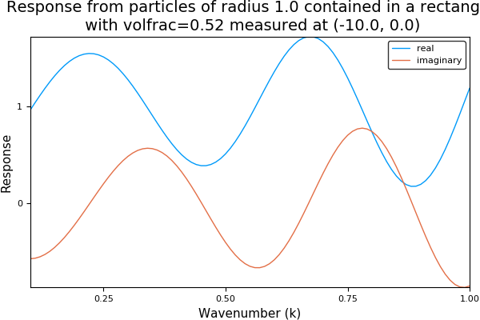

# Simple introductory example
## Run
Define two particles, the first centred at [-2.,2.] and the second at [-2.,-2.]
```julia
p1 = Particle([-2.,2.])
p2 = Particle([-2.,-2.])
particles = [p1,p2]
```

Specify the angular frequency of the defualt incident plane wave  and calculate the response
```julia
w_arr = collect(0.1:0.01:1.)
simulation = FrequencySimulation(particles, w_arr; source_direction = [1.0,0.0])
```

## Plot
The package also provides recipes to be used with the `Plots` package for
plotting simulations after they have been run.
In our above simulation we ran the simulation for 100 different wavenumbers, and
measured the response at the default location (-10.,0.).
We can plot the time-harmonic response across these wavenumbers by typing:
```julia
using Plots
pyplot()
plot(simulation)
```


For a better overview you can plot the whole field for a specific k by typing:
```julia
plot(simulation,0.8)
```


This measures the field at lots of points in the domain rather than just at the listener position (the big green ball).
This way we can get an understanding of what is happening for one particular
wavenumber.

Note: most things in the package can be plotted by typing `plot(thing)` if you
need an insight into a specific part of your simulation.