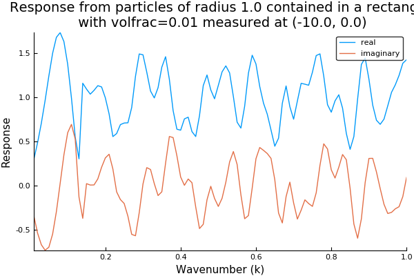
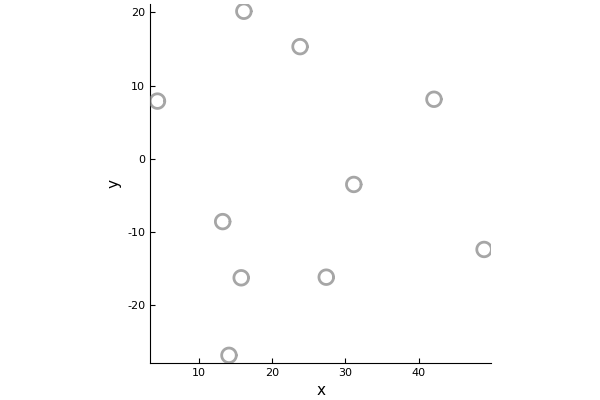
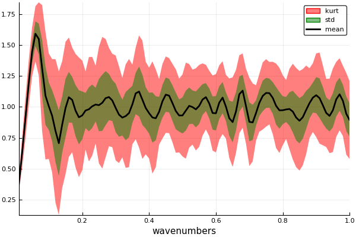

# StatisticalMoments

Here we are going to simulate the scattered wave for many different configurations of particles. We can then take the average and standard deviation (the moments) of the scattered wave. In statistical mechanics this process is called [ensemble average](https://en.wikipedia.org/wiki/Ensemble_average_(statistical_mechanics)).

## Choose the type of particles
```julia
using MultipleScattering

volfrac = 0.01
radius = 1.0
num_particles = 10

# region to place the particles
shape = Rectangle(volfrac, radius, num_particles)
```
To see the region where the particle will be placed:
```julia
using Plots
pyplot()
plot(shape)
```

## Calculate the moments of the scattered wave
The code below chooses a random (uniform distribution) configuration of particles inside `shape` and calculates the received signal at `listener`
```julia
listener = [-10.0, 0.0]
simulation = FrequencySimulation(volfrac,radius,k_arr; shape=shape, listener_positions = listener, seed = 1)
plot(simulation)
```


To see the position of the chosen particles:
```julia
plot()
plot!.(simulation.particles);
gui()
```


Now we will do simulations for the particles placed in different configurations and take the moments:
```julia
simulations = [
    FrequencySimulation(volfrac,radius,k_arr; shape=shape, listener_positions = listener, seed = i)
for i = 1:20]
real_moments = StatisticalMoments(simulations; response_apply=real) # moments of the real part
plot(real_moments);
plot!(xlabel="wavenumbers", title="Moments of the real part")
```


## Calculate the moments of the scattered wave in time
```julia
time_simulations = TimeSimulation.(simulations)
time_simulations[1].time_arr # the time_arr chosen will be based on the discrete Fourier transform of simulations[1].k_arr
real_time_moments = StatisticalMoments(time_simulations; response_apply=real) # moments of the real part
plot(real_time_moments,xlims=(0,300));
plot!(xlabel="time", title="Moments of the real part of the time wave")
```


## References

A. L. Gower, R. M. Gower, J. Deakin, W. J. Parnell, I. D. Abrahams,
Learning about random media from near-surface backscattering:
using machine learning to measure particle size and concentration,
arXiv preprint,
(2018)1801.05490
