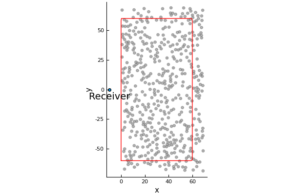

# Near-surface backscattering: a method of accurately calculating the backscattering from an infinite halfspace.

First, let us see why it is difficult to approximate the scattering from a halfspace filled with particles. That is, let us find out how many particles are required before the backscattering converges.

## Generate a large material filled with particles.

```julia
using MultipleScattering
using Plots
pyplot(linewidth=2)

radius = 0.8
volfrac = 0.10
max_width = 60.

bottomleft = [0.,-max_width]
topright = [max_width,max_width]

shape = Rectangle(bottomleft,topright)
particles = random_particles(volfrac, radius, shape; c=1.0+0.0im, ρ=0.0)
```
We will measure the backscattering at `listener_position`:

```julia
listener_position = [-10.,0.]
scatter([listener_position[1]],[listener_position[2]]);
annotate!([(listener_position[1], listener_position[2] -2.0, "Receiver")])
plot!.(particles);
plot!(shape)
```


## Calculate backscattering for different quantity of particles
We will shave off particles on the right of this group of particles (material), and then calculate the resulting backscattered waves.
```julia
widths = 10.:10.:max_width # choose the width of the region filled with particles
k_arr = collect(0.01:0.01:1.) # choose the wavenumbers of the incident wave

simulations = map(widths) do w # this is a for loop over the array widths
    shape.topright[1] = w # choose a material with a smaller width
    ps = filter(p -> inside(shape,p), particles) # shave off particles
    FrequencySimulation(ps, k_arr) # calculate backscattering
end

backscattered_waves = [s.response for s in simulations]
num_particles = [length(s.particles) for s in simulations]

M = length(backscattered_waves)
bM = backscattered_waves[M] # backscattering from largest material
differences = [norm(b - bM) for b in backscattered_waves[1:(M-1)]]./norm(bM)

plot_converge = plot(num_particles[1:(M-1)], differences, xlabel = "number of particles", ylabel ="error %", label="frequency convergence")
```
The graph shows the rate of convergence, that is, it tell us how many particles we need before the backscattered wave no longer changes.
```julia
time_simulations = TimeSimulation.(simulations)

times = 2*(widths .- listener_position[1]) # time if takes for an incident plane wave to reach the furthest particles and then return to the receiver

plot()
for i=1:length(num_particles)
    plot!(time_simulations[i],label="$(num_particles[i]) particles"
        , xlims=(0,maximum(xticks)+10.), ylims=(-0.2,0.2)
        , xticks = [0.; times]
    )
end
gui()
```

```julia
time_arr = 0.:pi:80
time_simulations = [TimeSimulation(s;time_arr=time_arr) for s in simulations]

backscattered_waves = [s.response for s in time_simulations]
bM = backscattered_waves[M] # backscattering from largest material
differences = [norm(b - bM) for b in backscattered_waves[1:(M-1)]]./norm(bM)
plot_converge
plot!(num_particles[1:(M-1)], differences, xlabel = "number of particles", ylabel ="error %", label="time convergence")
```

```julia
near_surface_simulations = map(times) do t
    shape = TimeOfFlight(listener_position,t) # choose a material with particles only in the near surface region
    ps = filter(p -> inside(shape,p), particles) # shave off particles
    FrequencySimulation(ps, k_arr) # calculate backscattering
end
```
