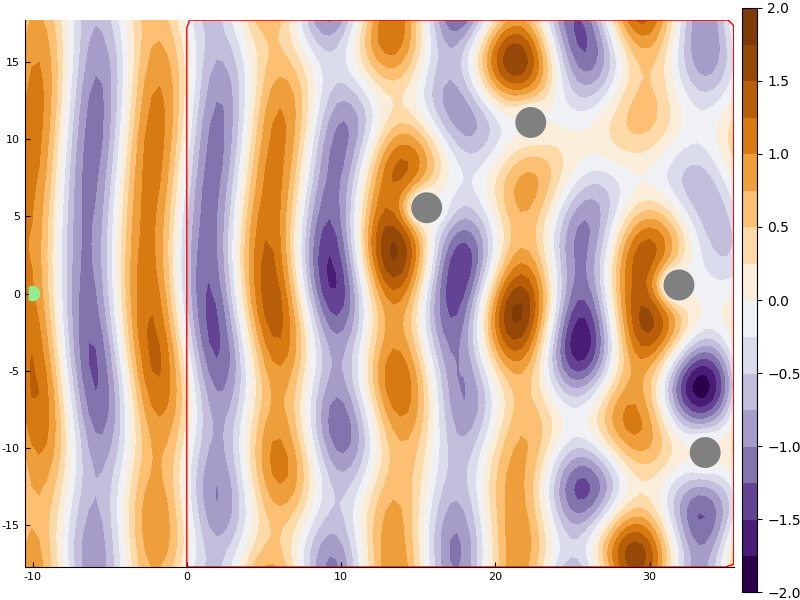

# Simple random particles example

If it isn't installed, clone it from github
```julia
try using MultipleScattering
catch
    Pkg.clone("https://github.com/jondea/MultipleScattering.jl.git")
end

using MultipleScattering
```

Define the fraction of the volume the particles will take up, their radius and
which wavenumbers (k) to evaluate at
```julia
volfrac = 0.01
radius = 1.0
k_arr = collect(linspace(0.01,1.0,100))
model = FrequencySimulation(volfrac,radius,k_arr)
```

We use the `Plots` package to plot both the response at the listener position
and the whole field for a specific wavenumber (k=0.8)
```julia
using Plots
plot(
    plot(model),
    plot(model,0.8;res=100)
)
```




## Things to try
- Try changing the volume fraction, particle radius and k values we evaluate
